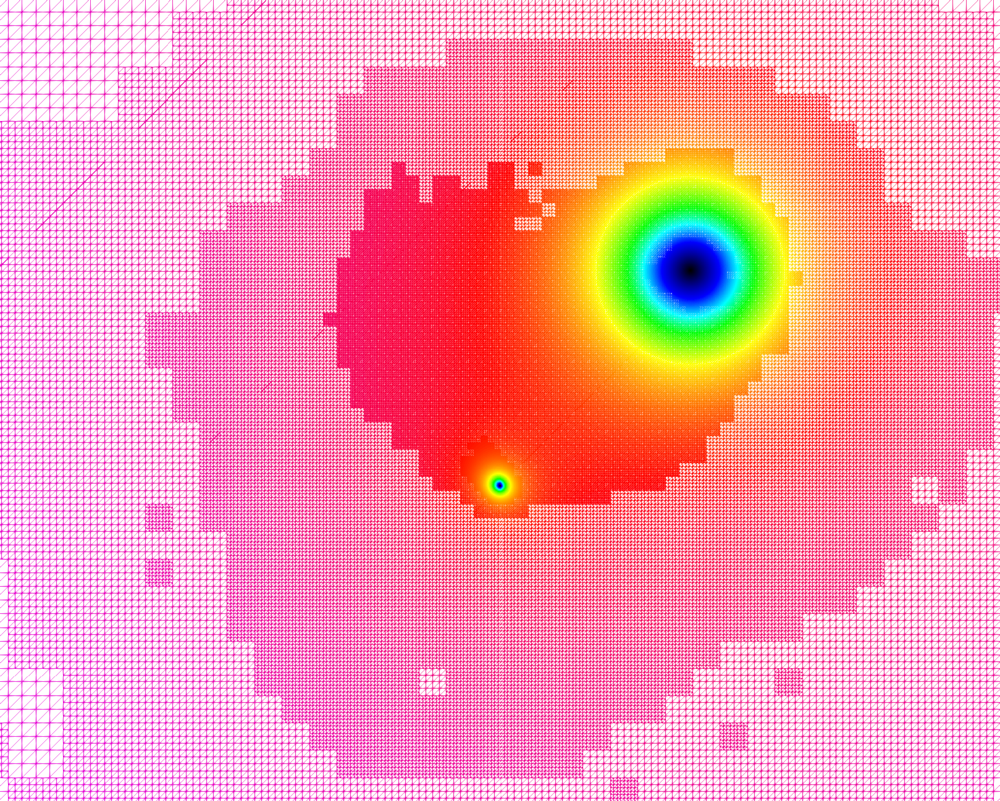

# WIP : Code will be added after all tests are done

# Dendro-GRCA 
<p align="center">

</p>
"Dendro" in Greek language means tree. The Dendro library is a large scale (262K cores on ORNL's Titan) 
distributed memory adaptive octree framework. The main goal of Dendro is to perform large scale multiphysics simulations 
efficeiently in mordern supercomputers. Dendro consists of efficient parallel data structures and algorithms to perform 
variational (finite element) methods and finite difference mthods on 2:1 balanced arbitary adaptive octrees which enables 
the users to perform simulations raning from black holes (binary black hole mergers) to blood flow in human body, where applications 
ranging from relativity, astrophysics to biomedical engineering.  

Dendro-GRCA is developed originally from a team, including Hyun Lim, 
in University of Utah and Brigham Young University. 
This is a LANL disclosure version from open Dendro repository. 
You can find detailed information about this in [Dendro-5.01](https://github.com/paralab/Dendro-5.01)

## How to build Dendro?

Dendro can be installed anywhere in your system but we suggest
that all repositories are downloaded in DENDRO root directory 
such as `${HOME}/DENDRO`

### Suggested directory structure

We recommend to have following directory structure:

```{engine=sh}
  ${HOME}/DENDRO
  ├── Dendro-GRCA
  │   └── build
  └── local
      ├── bin
      ├── include
      ├── lib
      ├── lib64
      └── share
```

Below we use `${HOME}/DENDRO/local` for an installation directory.
Make sure to set your CMAKE prefix to this location:

    % export CMAKE_PREFIX_PATH=${HOME}/DENDRO/local

### Prerequisites

You will need the following tools:

- C++11 - capable compiler, such as gcc version >= 4.8;
- MPI libraries, compiled with the gcc compiler above and multithread support
  (`--enable-mpi-thread-multiple` for OpenMPI and
   `--enable-threads=multiple` for MPICH);
- cmake version > 2.8;
- Python version > 3.5; (For RHS generation scripts. Not required for 
building code unless you want to generate RHS during compile time)
- zlib compression library;
- BLAS and LAPACK

#### Building Dendro

Clone the master branch from the Dendro-GRCA git repo:
```{engine=sh}
   cd $HOME/DENDRO
   git clone git@github.com:lanl/Dendro-GRCA.git
```    

After cloning the repo, follow the configure command:
(copy and paste below into your temrinal)
```{engine=sh}
   cd Dendor-GRCA ;
   mkdir build ; cd build
   export CMAKE_PREFIX_PATH=${HOME}/DENDRO/local
   cmake .. \
       -DCMAKE_INSTALL_PREFIX=$CMAKE_PREFIX_PATH \
       -DALLTOALLV_FIX=OFF                       \
       -DHILBERT_ORDERING=ON                     \
       -DPROFILE_TREE_SORT=OFF                   \
       -DSPLITTER_SELECTION_FIX=ON               \
       -DNUM_NPES_THRESHOLD=2                    \
       -Who-dev
```

Normally, you should have the C, C++, Objective-C, Fortran, and among other
compilers, as well as runtime libraries for C++, Objective-C, and Fortran if you install GCC.
Sometimes, CMake complains such as

```{engine=sh}
  No CMAKE_Fortran_COMPILER could be found.
```

In this case, you can check whether you have that compiler or not by using
```{engine=sh}
which <CMake_not_found_complier>
```
This will show the path of complier. If this does not show anything, 
you should install that specific complier. If this shows the path, you can export via

```{engine=sh}
export CMAKE_<Complier_name>_COMPILER = <path_to_compiler>
```
After that, following above configure command again. 
Similar argument can be applied to `MPI` library.

Once your configuration is successful, you will see
```{engine=sh}
-- Configuring done
-- Generating done
-- Build files have been written to: ${HOME}/DENDRO/Dendro-GRCA/build
```
at the end of configuration.

After configuration, build and install inside of your `build` directory by:
```{engine=sh}
     make -j 
     make install
```
Note that if your machine does not support parallel job, 
you may not use `-j` option during `make`

### Note for MAC OSX user

Because of MacOS use LLVM complier, gcc (or g++) links to clang complier. 
This is not compatible OpenMp. (You cannot use -fopenmp as the flag). Here is two possible solution.

You can install gnu complier manually, and use gnu complier as your complier. 
Then, gnu links OpenMP automatically.

Mac has own version of OpenMP, called [clang-omp](https://clang-omp.github.io/). 
You can install this, and link this for using OpenMp in Mac.


## Running Dendro application : Example with QG project

Once you successfully building the Dendro, you will have `quadgravSolver` 
in your `build` directory and/or `${HOME}/DENDRO/local/bin`.

You can run `quadgravSolver` as follow
```{english=sh}
  mpirun -np <number of mpi tasks> ./quadgravSolver <parameter file name>.par
```
An example parameter file can be found in `QuadGrav/par`. You can 
create your own parameter file based on this

## Details About the Code
If you are interested in learning details about this toolkit, 
please check the [publication](https://epubs.siam.org/doi/10.1137/18M1196972)

## Visualization
We are using Paravies as our visualization toolkit with parallel vtu output. 

## Contact
Please contact Hyun Lim via hyunlim@lanl.gov if you have any
questions or problem.

## Copyright
© 2020. Triad National Security, LLC. All rights reserved.\
This program was produced under U.S. Government contract 89233218CNA000001 for Los Alamos\
National Laboratory (LANL), which is operated by Triad National Security, LLC for the U.S.\
Department of Energy/National Nuclear Security Administration. All rights in the program are\
reserved by Triad National Security, LLC, and the U.S. Department of Energy/National Nuclear\
Security Administration. The Government is granted for itself and others acting on its behalf a\
nonexclusive, paid-up, irrevocable worldwide license in this material to reproduce, prepare\
derivative works, distribute copies to the public, perform publicly and display publicly, and to permit\
others to do so.


